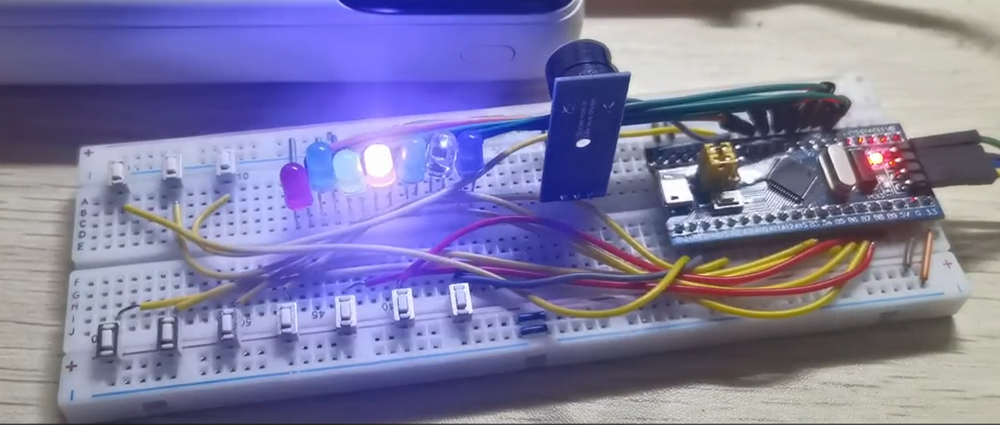
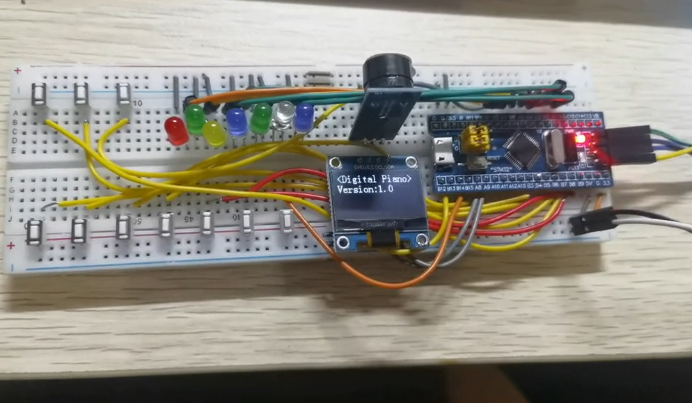
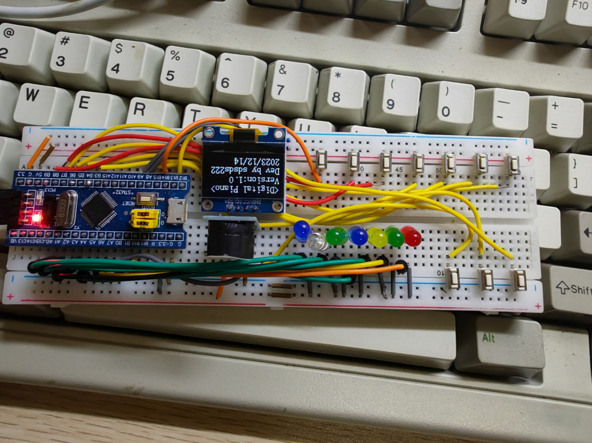

# STM32电子琴-DigitalPiano-STM32

#### 介绍
用STM32f103c8t6、标准库和C语言制作的电子琴，发声单元使用无源蜂鸣器，基于PWM方法控制音调，支持高、低两个阶段的音调。

支持演奏模式、录制模式和播放录制模式。

bilibili：【《点 灯 大 师》8-bit蜂鸣器电子琴 stm32-哔哩哔哩】 [https://b23.tv/EXwwtJz](https://www.bilibili.com/video/BV1qa4y19792/?vd_source=d1681b7d6b38237df98a7c9aa196d8ce#reply664650158)

接线手册：

开发板使用STM32F103C8T6，接线手册如下：

按钮一端GND，另一端接GPIO引脚：

按钮1：B14

按钮2：B9

按钮3：B8

按钮4：B7

按钮5：B6

按钮6：B5

按钮7：B4

下按钮1：B1

下按钮2：B15

下按钮3：B12

LED灯一端3.3V，另一端接GPIO引脚：

LED1：A0

LED2：A1

LED3：A2

LED4：A3

LED5：A4

LED6：A5

LED7：A6

OLED显示器：

SDA：A9

SCL：A8

VCC：3.3V

GND：GND

无源蜂鸣器：

I/O：B0

VCC：3.3V

GND：GND

接线对应图片：

#### 参与贡献

1.  Fork 本仓库
2.  新建 Feat_xxx 分支
3.  提交代码
4.  新建 Pull Request> 
